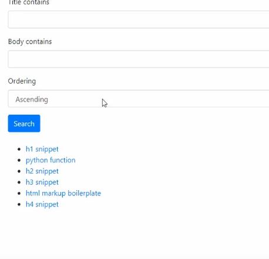

```python

CHOICES = (
    ('ascending', 'Ascending),
    ('descending', 'Descending')
)

ordering = django_filters.ChoiceFilter(
    label='Ordering',
    choices=CHOICES,
    method='filter_by_order
)
# Crée un champ qui s'appelle Ordering et qui permet
# de filtrer selon deux choix croissant ou décroissant
# puis permet d'exécuter chacune de ces action à partir
#  de la fonction filter_by_order.
# Le fonction filter_by_order représente la manière dont
# le filtre va s'appliquer grace à queryset.order_by(manière)

class Meta:
    model = Snippet
    fields = {
        'title' : ['icontains'],
        'body' : ['icontains'],
    }
    # filtre les résultats en fonction de ce qu'ils contiennent

def filter_by_order(self, queryset, name, value):
    expression = 'created' if value == 'ascending' else '-created'
    return queryset.order_by(expression)
    # comme une list comprehension, un genre de string comprehension
    # expression dit si created est s
```
Cela permet de créer un filtre permettant de positionner des valeurs du plus petit au plus grand ou l'inverse.



---
---

On a un modèle
```python
class Order(models.Model):
    STATUS = (
        ('Pending', 'Pending'),
        ('Out for delivery', 'Out for delivery'),
        ('Delivered', 'Delivered'),
    )

    customer = models.ForeignKey(Customer, null=True...)
    products = models.ForeignKey(Product, null=True, on...)
    date_created = models.DateTimeField(auto_now_add=True...)
    status = models.CharField(max_length=200, null=True...)

    def __str__(self):
        return self.product.name
```

Dans notre fichier filters.py
```python
import django_filters

from .models import *

class OrderFilter(django_filters.FilterSet):
    class Meta:
        model = Order
        fields = '__all__'
    # tu appliques les filtres sur tous les champs
    # du modèle.
```

Dans notre fichier views.py
```python
from .filters import OrderFilter

def customer(request, pk_test):
    customer = Customer.objects.get(id=pk_test)
    # Cela permet de choisir l'item ou les items à afficher
    # grâce à leur pk

    orders = customer.order_set.all()
    # cela veut dire que tout ton set 
    # sera ordonné de la même manière

    order_count = orders.count()
    # récupères le nombre de orders.

    myFilter = OrderFilter(
        request.GET, queryset=orders
    )
    # récupères tous les orders du queryset donné
    # à OrderFilter
    
    order = myFilter.qs
    # l'ordre des orders sera celui de myFilter.querySet

    context = {
        'customer':customer,
        'orders':orders,
        'order_count':order_count,
        'myFilter':myFilter
    }
    # Voici les items qui vont être ordonnés
    return render(request, 'accounts/customer.html', context)
```

Maintenant que tout cela est fait, on va travailler encore filters.py
```python
Dans notre fichier filters.py
```python
import django_filters
from django_filters import DateFilter

from .models import *

class OrderFilter(django_filters.FilterSet):

    start_date = DateFilter(field_name="date_created", lookup_expr='gte')
    end_date = DateFilter(field_name="date_created", lookup_expr='lte')

    class Meta:
        model = Order
        fields = '__all__'
        exclude = ['customer', 'date_created']
        # on exclu les champs déjà crées du modèle pour en créer des nouveaux
        # directement dans le filters.py
```
```